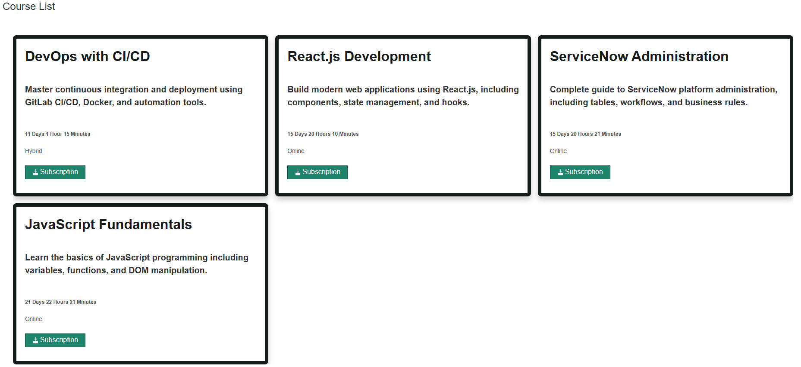
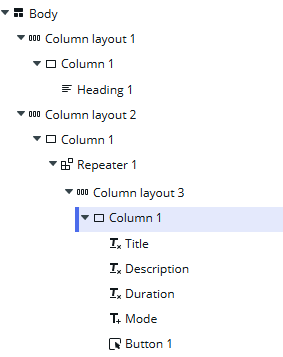
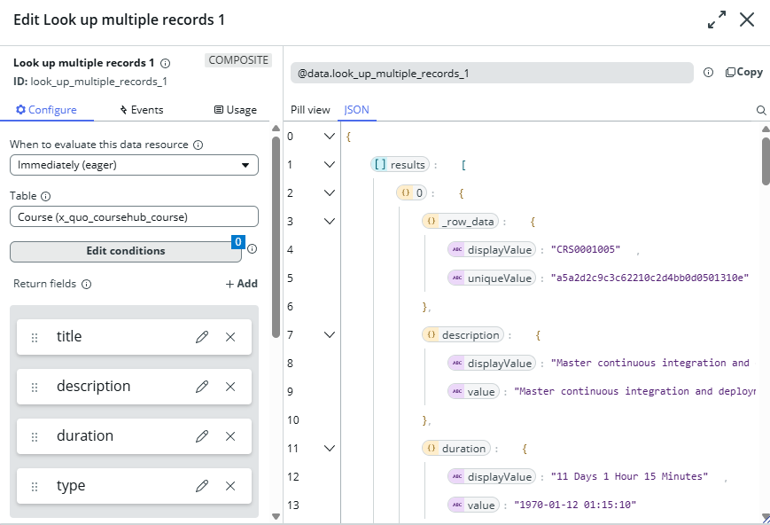

# Course Hub with ServiceNow

The project is a template for Course Subscription Application developed using ServiceNow platform. Designed to let learners to browse, subscribe, and manage courses. Built with UI Builder. The PRD01: Course List part it is implemented and fully functional while fetching and displaying the list of available courses from backend ServiceNow. The PRD02: COurse Subscription it is remain not functionality and it is not implemented due to the platform learning curve and its constrains.

Repository: https://github.com/FatlumGerguri/coursehubDCM

## Implemented Features

✅ PRD01: Course List - COMPLETED

This part displays a list of the available courses with course detaisl and a Subscriber button for each course.

Course Listing implemented using table x_quo_coursehub_course and displayed using components: nxt-component-a, nxt-component-b.”

Table Used: x_quo_coursehub_course
Displayed Fields: Title, Description, Type (Online/Offline/Hybrid), Duration
UI Components:
now-layout-container – Page layout
now-repeater – Dynamically iterate through courses
now-card – Display each course as a card
now-button – Display "Subscribe" buttons
now-stylized-text – Display the Description of course
Data Resources:
Look up multiple records to fetch all course entries from the course table

## User Intersepction

When a user accesses the Course Subscription application, they are presented with a simple and clear interface to explore available courses. Here's how they interact with the key feature implemented in this submission:

Access the Application
The learner logs in to the platform and navigates to the CourseHub experience using a web link (e.g., /x/quo/qdx-course-hub/home). This link opens the Course Listing page, which is the main interface built for this assignment.

View the Course List (PRD01)
Upon loading the page, the learner sees a list of courses displayed in a proper format. Each course is shown inside a visual card layout, which includes the following details:

Course Title: The name of the course is shown as the main heading
Description: A short summary that describes the course content
Type: Indicates whether the course is Online, Offline, or Hybrid
Duration: How long the course takes, shown in a readable format
Interact with Course Cards
Each course card includes a "Subscribe" button. Although this button does not yet perform any subscription action, it is designed to guide learners toward subscription.

Next Action (TODO)
Clicking the Subscribe button will confirm their subscription, and provide immediate feedback — such as showing a success message and changing the button to "Unsubscribe."

## Setup and Installation Process

### Prerequisites

1. ServiceNow Personal Developer Instance (PDI)
2. Git access to repository
3. Basic understanding of ServiceNow UI Builder

### Installation Steps

1. Clone repository: git clone https://github.com/roshanbist/coursehub-servicenow
2. Import application into ServiceNow Studio using Git integration
3. Verify tables and data model import
4. Access UI Builder and navigate to CourseHub experience
5. Open Home page to view course listings

## Screenshoots Description

All the screenshoots taked are located in the /screenshoots folder:

1. prd01-01-course-list.png: Displays the course list that are available.

2. prd01-02-component-layout.png: Displays the hierarchy built in UI Builder.
   

3. prd01-03-course-resource.png: Display the Data Resource setup for fetching course details.
   

## Conclusion
